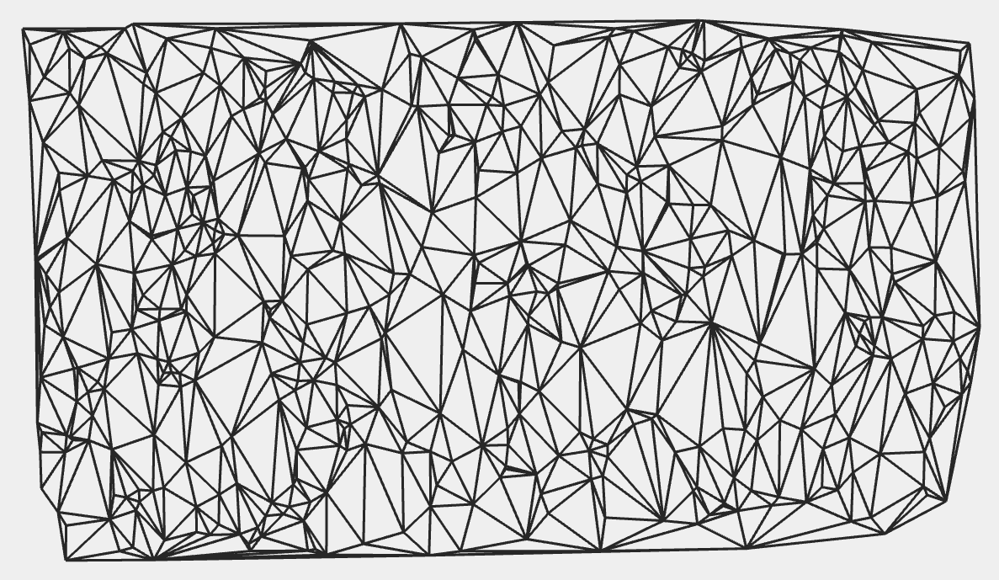

# 190619_delaunay Triangulation
with `ofxDelaunay`




````c++
void ofApp::setup(){
	ofSetFrameRate(60);
	ofBackground(239);
	ofSetColor(39);
	ofSetLineWidth(1);
	ofTranslate(ofGetWidth() * 0.5, ofGetHeight() * 0.5);
	for (int i = 0; i <1000; i++)
	{
		float x = ofRandom(ofGetWidth());
		float y = ofRandom(ofGetHeight());
		vec2list.push_back(glm::vec2(x, y));
	}
}

//--------------------------------------------------------------
void ofApp::update(){
	ofSeedRandom(39);
}

//--------------------------------------------------------------
void ofApp::draw(){
	camera.begin();
	for (int i = 0; i < vec2list.size(); i++)
	{
		auto x = vec2list[i].x;
		auto y = vec2list[i].y;
		x += ofMap(ofNoise(ofGetFrameNum() * 0.005, ofRandom(1000)), 0, 1, -10, 10);
		y += ofMap(ofNoise(ofGetFrameNum() * 0.005, ofRandom(1000)), 0, 1, -10, 10);
		ofPoint randomPoint(x, y);
		delaunay.addPoint(randomPoint);
	}
	delaunay.triangulate();

	delaunay.triangleMesh.drawWireframe();
	camera.end();
}

int main( ){
	ofSetupOpenGL(1280,720,OF_WINDOW);			// <-------- setup the GL context
	ofRunApp(new ofApp());
}
````
Delaunay triangluation 을 생성하는 알고리즘에 대해 공부 해보고 싶다. 
그러나 잘 작성된 라이브러리가 있기 때문에 내가 직접 알고리즘을 작성하고 정당성을 증명하는건 조금 미루어본다 ㅋㅋ.  
내가 추후에 읽어야할 것을 아래에 링크로 남겨두었다.   

http://page.mi.fu-berlin.de/FANIRY/files/faniry_aims.pdf  
