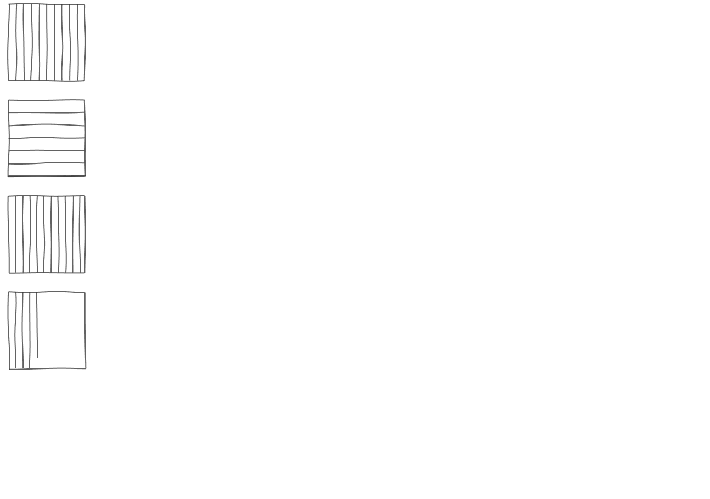

# 190706_HandWritingRectangle

from `hayato works`



## impressing part 

뭐라할까... 진짜 handwriting 같다...  보자마자 따라해야겠다 .. 라는 생각이 들어 무작정 소스로 뛰어들었다.  
다만 조금은 실망한 점은, 소스가 생각보다 촘촘하게 짜여있다 라는 느낌이 들었다. hayato 씨는 재 생산성에 중점을 두었던것 같다.  

## algorithm 

1.
전체적인 흐름은 사각형을 둔다. 이때 사각형은 반듯하다고 가정한다. 그 뒤에 사각형의 좌상부터 우상까지 선을 긋는다고 가정한다. 이 때, 선은 `noise`가 끼어있게끔 구현하기 위해 좌상에서 우상까지의 단위 거리마다 `point`를 상하로 `noise`를 넣는다. 아래는 그 소스이다. 

````C++
void getLine(std::vector<ofVec2f>& points, ofVec2f start, ofVec2f end)
{
    float length = (end - start).length();
    float drawLen = 0;
    ofVec2f dir = end - start;
    ofVec2f point = start;
    dir.normalize();
    ofVec2f vert = dir;
    vert.rotate(90);

    float tx = ofRandom(10000);

    while (drawLen < length) {
        float offset = ofMap(ofSignedNoise(tx), -1, 1, -3, 3);
        tx += 0.01;
        points.push_back(point + vert * offset);

        point = point + dir;
        drawLen = (point - start).length();
    }
}
````
`ofVec2f`의 `normalize`와 그것의 수직인 `vert`는 각각 단위거리와 상하 noise `vert * noise`이다. 현재까지 그린 길이가 충분할 때까지 반복한다.  

2.
수직 stripe이냐 수평 stripe는 순전히 랜덤하게 달려있다. 그리고 그 간격 또한 랜덤하게 구현되었다. 그리고 그 간격을 반복하며 위 함수 `getLine`을 수행하는 것이다. 

3.
마지막으로 모든 점들이 저장되었다면, 매 드로우 함수 마다 점과 점을 이어주는 선을 한개씩 그어주면된다. 점들은 촘촘하게 구성되어 천천히 그리는 효과를 제공한다. 이 소스에서는 `ofFbo`에 그리며, `ofFbo`를 출력한다.


