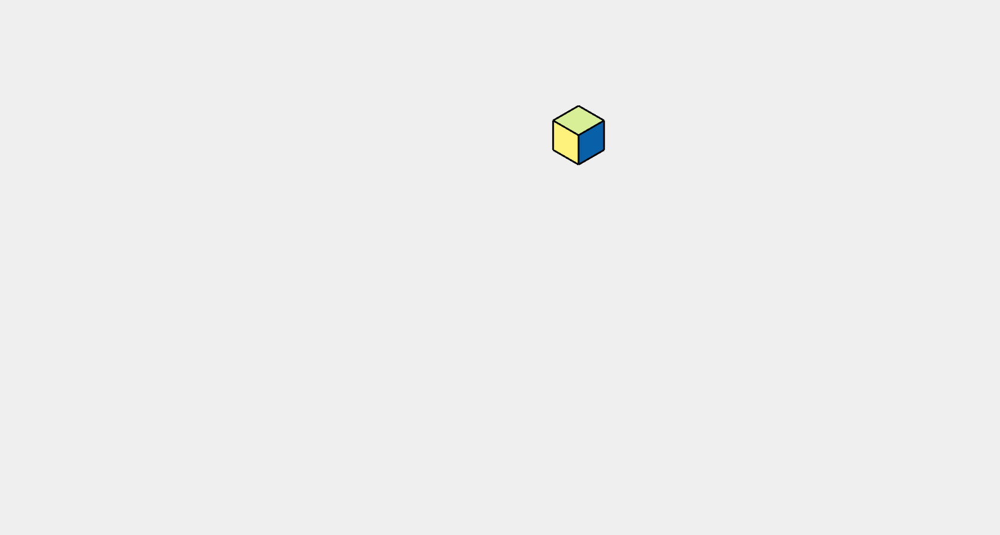

# 190717_Trick

from `h.works`



```c++
// opApp.cpp
void ofApp::setup() 
{
	ofBackground(239);
	ofSetVerticalSync(true);

	trick = make_shared<Trick>();
	trick->setup();
}

void ofApp::update() {
	trick->update();
}

void ofApp::draw()
{
	trick->display();
}

// Trick.hpp
class Trick
{
public:
	Trick() { }
	~Trick() { }

	void setup()
	{
		ofVec2f d = ofVec2f(0, 1);
		float len = 50;
		int num = 6;

		box.push_back(ofVec2f(0, 0));

		for (int i = 0; i < num; i++)
		{
			ofVec2f org = d;
			box.push_back(org.rotate((360 / num) * i) * len);
		}
		step = 0;
		pos = ofVec2f(ofGetWidth() / 2 + 100, 250);
		fbo.allocate(ofGetWidth(), ofGetHeight(), GL_RGBA, 4);
	}

	void update()
	{
		if (ofGetFrameNum() % 30 == 0) {
			fbo.begin();
			if (step == 0) {
				drawBox(pos);
			}
			else if (step <= 4) {
				pos = pos + box.at(2);
				drawBox(pos);
			}
			else if (step <= 8) {
				pos = pos + box.at(6);
				drawBox(pos);
			}
			else if (step <= 10) {
				pos = pos + box.at(4);
				drawBox(pos);
			}
			else if (step == 11) {
				drawLastBox(pos + box.at(4));
			}
			fbo.end();

			step++;
		}
	}

	void display()
	{
		fbo.draw(0,0);
	}

private:
	void drawBox(ofVec2f c)
	{
		ofFill();
		ofSetColor(255, 242, 124);
		ofBeginShape();
		ofVertex(c + box.at(0));
		ofVertex(c + box.at(1));
		ofVertex(c + box.at(2));
		ofVertex(c + box.at(3));
		ofEndShape();

		ofSetColor(217, 239, 151);
		ofBeginShape();
		ofVertex(c + box.at(0));
		ofVertex(c + box.at(3));
		ofVertex(c + box.at(4));
		ofVertex(c + box.at(5));
		ofEndShape();

		ofSetColor(8, 96, 168);
		ofBeginShape();
		ofVertex(c + box.at(0));
		ofVertex(c + box.at(5));
		ofVertex(c + box.at(6));
		ofVertex(c + box.at(1));
		ofEndShape();


		ofNoFill();
		ofSetLineWidth(3);
		ofSetColor(0);
		ofBeginShape();
		ofVertex(c + box.at(0));
		ofVertex(c + box.at(1));
		ofVertex(c + box.at(2));
		ofVertex(c + box.at(3));
		ofEndShape();

		ofSetColor(0);
		ofBeginShape();
		ofVertex(c + box.at(0));
		ofVertex(c + box.at(3));
		ofVertex(c + box.at(4));
		ofVertex(c + box.at(5));
		ofEndShape();

		ofSetColor(0);
		ofBeginShape();
		ofVertex(c + box.at(0));
		ofVertex(c + box.at(5));
		ofVertex(c + box.at(6));
		ofVertex(c + box.at(1));
		ofEndShape();
	}
	void drawLastBox(ofVec2f c)
	{
		ofFill();
		ofSetColor(255, 242, 124);
		ofBeginShape();
		ofVertex(c + box.at(0));
		ofVertex(c + box.at(1));
		ofVertex(c + box.at(2));
		ofEndShape();

		ofSetColor(8, 96, 168);
		ofBeginShape();
		ofVertex(c + box.at(0));
		ofVertex(c + box.at(5));
		ofVertex(c + box.at(6));
		ofVertex(c + box.at(1));
		ofEndShape();

		ofNoFill();
		ofSetLineWidth(3);
		ofSetColor(0);
		ofBeginShape();
		ofVertex(c + box.at(0));
		ofVertex(c + box.at(1));
		ofVertex(c + box.at(2));
		ofEndShape();

		ofSetColor(0);
		ofBeginShape();
		ofVertex(c + box.at(0));
		ofVertex(c + box.at(5));
		ofVertex(c + box.at(6));
		ofVertex(c + box.at(1));
		ofEndShape();
	}

	vector<ofVec2f> box;
	ofVec2f pos;
	int step;
	ofFbo fbo;
};
```

결과물에 대해서 굳이 할 말이 있을까? 멋지다. 심지어 소스도 깔끔하다. 다만, 내가 이해하는데는 시간이 조금 걸릴것 같아 여기서 조금 내용을 정리해보려고 한다. 

## 1 setup 
```C++
void setup()
{
    ofVec2f d = ofVec2f(0, 1);
    float len = 50;
    int num = 6;

    box.push_back(ofVec2f(0, 0));

    for (int i = 0; i < num; i++)
    {
        ofVec2f org = d;
        box.push_back(org.rotate((360 / num) * i) * len);
    }
    step = 0;
    pos = ofVec2f(ofGetWidth() / 2 + 100, 250);
    fbo.allocate(ofGetWidth(), ofGetHeight(), GL_RGBA, 4);
}
````

box vector엔 (0,1) 단위 벡터를 60도 씩 회전한 것을 넣는다. 0,0도 넣는다.  


## 2 update

```C++
void update()
{
    if (ofGetFrameNum() % 30 == 0) {
        fbo.begin();
        if (step == 0) {
            drawBox(pos);
        }
        else if (step <= 4) {
            pos = pos + box.at(2);
            drawBox(pos);
        }
        else if (step <= 8) {
            pos = pos + box.at(6);
            drawBox(pos);
        }
        else if (step <= 10) {
            pos = pos + box.at(4);
            drawBox(pos);
        }
        else if (step == 11) {
            drawLastBox(pos + box.at(4));
        }
        fbo.end();

        step++;
    }
}
```
frame이 30카운트가 될때마다, 즉.. 설정에 따라 일정 시간 간격으로 pos를 이동시킨다. 얼마만큼 이동시키냐면 box.at(i) 만큼이다. 

직육면체를 그릴때는, 기준점(0,0)과 60도를 회전시키며 얻어낸 box 를 이용하여 직육면체 가장 앞 쪽으로 튀어나온 모서리에서 (0,0) 기준점을 기준으로 0도 돌린 아래로 선, 시계방향으로 60도, 120도 사각형을 그리고...  
기준점 (0,0)에서 120도 180도 240도 를 기점으로 사각형을 그린다.  

마지막 박스 드로잉 일땐 일부는 삼각형을 그리는 것이다. 참 재밌고, 위트있는 소스였다. 그리고 심지어 깔끔하다 !

